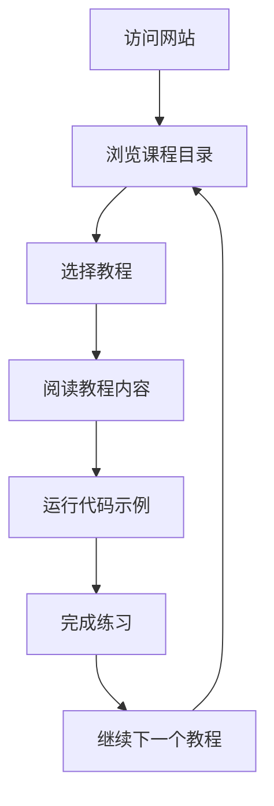

## 1. Product Overview
Python学习网站是一个全面的在线学习平台，为不同水平的学习者提供系统化的Python编程教程。
- 主要目的是帮助用户从零基础开始学习Python，掌握编程技能，解决实际问题。
- 目标用户包括编程初学者、学生、教师和希望提升技能的专业人士。

## 2. Core Features

### 2.1 User Roles
| Role | Registration Method | Core Permissions |
|------|---------------------|------------------|
| Guest User | No registration required | Browse all content, view examples, run code snippets |
| Registered User | Email registration | Save progress, bookmark lessons, participate in discussions |

### 2.2 Feature Module
1. **首页**: 网站介绍、课程导航、最新内容、学习路径
2. **课程目录**: 按主题分类的教程列表，包括基础、进阶、高级内容
3. **教程详情页**: 详细的教程内容，代码示例，练习，讨论区
4. **代码编辑器**: 在线运行Python代码的交互式编辑器
5. **学习路径**: 推荐的学习顺序和进度跟踪

### 2.3 Page Details
| Page Name | Module Name | Feature description |
|-----------|-------------|---------------------|
| 首页 | Hero部分 | 网站介绍、主要功能展示、快速开始按钮 |
| 首页 | 课程导航 | 按难度和主题分类的课程链接 |
| 首页 | 最新内容 | 最近更新的教程和示例 |
| 首页 | 学习路径 | 推荐的学习顺序和进度指示器 |
| 课程目录 | 分类导航 | 按主题和难度筛选课程 |
| 课程目录 | 课程列表 | 课程标题、简介、难度、时长 |
| 教程详情页 | 内容区域 | 详细的教程文本、代码示例、图片 |
| 教程详情页 | 代码示例 | 可运行的Python代码片段 |
| 教程详情页 | 练习 | 与教程相关的编程练习 |
| 教程详情页 | 讨论区 | 用户评论和问题解答 |
| 代码编辑器 | 编辑器界面 | 语法高亮、代码提示、运行按钮 |
| 代码编辑器 | 输出区域 | 代码执行结果展示 |
| 学习路径 | 路径图 | 可视化的学习进度和推荐顺序 |
| 学习路径 | 进度跟踪 | 已完成和未完成的课程标记 |

## 3. Core Process
用户访问网站 → 浏览课程目录 → 选择感兴趣的教程 → 阅读教程内容 → 运行代码示例 → 完成练习 → 继续下一个教程

## 4. User Interface Design
### 4.1 Design Style
- 主色调: #3776ab (蓝色)、#4caf50 (绿色)
- 辅助色: #f5f5f5 (浅灰)、#e0e0e0 (中灰)
- 按钮样式: 圆角矩形，悬停效果
- 字体: 主标题使用无衬线字体，正文使用易读的无衬线字体
- 布局风格: 卡片式布局，清晰的层次结构
- 图标风格: 简约现代的线性图标

### 4.2 Page Design Overview
| Page Name | Module Name | UI Elements |
|-----------|-------------|-------------|
| 首页 | Hero部分 | 大标题，简短描述，主色调背景，CTA按钮 |
| 首页 | 课程导航 | 卡片式分类，图标+文字，悬停效果 |
| 首页 | 最新内容 | 列表式布局，标题+简介+日期 |
| 首页 | 学习路径 | 可视化进度条，步骤指示器 |
| 课程目录 | 分类导航 | 侧边栏或顶部标签，筛选选项 |
| 课程目录 | 课程列表 | 卡片式布局，包含标题、难度、时长 |
| 教程详情页 | 内容区域 | 清晰的标题层级，代码块样式，图片布局 |
| 教程详情页 | 代码示例 | 语法高亮，复制按钮，运行按钮 |
| 教程详情页 | 练习 | 问题描述，输入区域，提交按钮 |
| 教程详情页 | 讨论区 | 评论列表，输入框，回复功能 |
| 代码编辑器 | 编辑器界面 | 分屏布局，工具栏，语法高亮 |
| 代码编辑器 | 输出区域 | 清晰的输出显示，错误提示 |
| 学习路径 | 路径图 | 流程图样式，节点连接，状态标记 |
| 学习路径 | 进度跟踪 | 完成/未完成状态，百分比显示 |

### 4.3 Responsiveness
- 桌面优先设计，同时支持平板和移动设备
- 响应式布局，在不同屏幕尺寸下自动调整
- 移动设备优化：触摸友好的界面元素，简化导航

### 4.4 3D Scene Guidance
- 不适用，本项目为教育网站，不需要3D场景