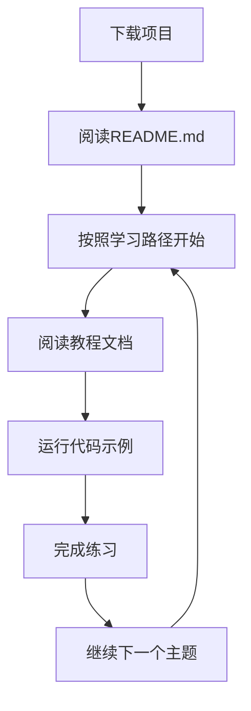

## 1. Product Overview
Python学习项目是一个本地的Python学习资源，为不同水平的学习者提供系统化的Python编程教程。
- 主要目的是帮助用户从零基础开始学习Python，掌握编程技能，解决实际问题。
- 目标用户包括编程初学者、学生、教师和希望提升技能的专业人士。

## 2. Core Features

### 2.1 User Roles
| Role | Registration Method | Core Permissions |
|------|---------------------|------------------|
| Local User | No registration required | Access all learning materials, run code examples locally |

### 2.2 Feature Module
1. **项目结构**: 按难度和主题分类的目录结构
2. **学习材料**: 详细的教程文档，包含理论知识和实践例子
3. **代码示例**: 可运行的Python代码示例，带有详细注释
4. **练习题目**: 与教程相关的编程练习，帮助巩固知识
5. **学习路径**: 推荐的学习顺序和进度跟踪

### 2.3 Page Details
| Page Name | Module Name | Feature description |
|-----------|-------------|---------------------|
| 项目根目录 | README.md | 项目介绍、学习路径指南、使用说明 |
| 基础目录 | 基础教程文件 | Python基础概念、语法和简单应用 |
| 进阶目录 | 进阶教程文件 | 函数、数据结构、模块等进阶内容 |
| 高级目录 | 高级教程文件 | 面向对象编程、文件操作、网络编程等 |
| 项目目录 | 实践项目 | 基于所学知识的综合实践项目 |
| 工具目录 | 辅助工具 | 代码编辑器配置、开发环境设置等 |

## 3. Core Process
用户下载项目 → 按照README.md的学习路径开始学习 → 阅读教程文档 → 运行代码示例 → 完成练习 → 继续下一个主题

## 4. User Interface Design
### 4.1 Design Style
- 目录结构清晰，按难度和主题分类
- 文档使用Markdown格式，易于阅读
- 代码示例带有详细注释
- 练习题目有明确的要求和提示

### 4.2 Page Design Overview
| Page Name | Module Name | UI Elements |
|-----------|-------------|-------------|
| README.md | 项目介绍 | 清晰的标题层级，学习路径图示，使用说明 |
| 教程文档 | 内容区域 | 理论讲解，代码示例，练习题目 |
| 代码示例 | 代码文件 | 语法高亮，详细注释，可直接运行 |
| 练习题目 | 练习文件 | 问题描述，提示，参考解答 |

### 4.3 Responsiveness
- 项目结构适合在本地环境中使用
- 文档和代码可在任何支持Markdown和Python的编辑器中打开
- 适合在不同操作系统上运行

### 4.4 3D Scene Guidance
- 不适用，本项目为本地学习资源，不需要3D场景