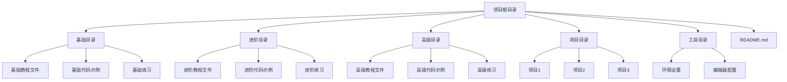

## 1. Architecture Design


## 2. Technology Description
- 主要技术: Python 3.8+
- 文档格式: Markdown
- 代码编辑器: 推荐使用 VS Code、PyCharm 或其他支持Python的编辑器
- 运行环境: 本地Python环境

## 3. Project Structure
| 目录/文件 | 用途 |
|-----------|------|
| / | 项目根目录 |
| /README.md | 项目介绍、学习路径指南、使用说明 |
| /basic/ | Python基础教程 |
| /basic/docs/ | 基础教程文档 |
| /basic/examples/ | 基础代码示例 |
| /basic/exercises/ | 基础练习题目 |
| /intermediate/ | Python进阶教程 |
| /intermediate/docs/ | 进阶教程文档 |
| /intermediate/examples/ | 进阶代码示例 |
| /intermediate/exercises/ | 进阶练习题目 |
| /advanced/ | Python高级教程 |
| /advanced/docs/ | 高级教程文档 |
| /advanced/examples/ | 高级代码示例 |
| /advanced/exercises/ | 高级练习题目 |
| /projects/ | 实践项目 |
| /tools/ | 辅助工具 |

## 4. Content Structure
### 4.1 教程文档结构
每个教程文档应包含以下部分：
- 主题介绍
- 理论讲解
- 代码示例
- 练习题目
- 参考资料

### 4.2 代码示例结构
每个代码示例应包含：
- 详细的注释
- 清晰的代码结构
- 可直接运行的代码
- 运行结果说明

### 4.3 练习题目结构
每个练习题目应包含：
- 问题描述
- 输入输出示例
- 提示
- 参考解答

## 5. Learning Path
1. **基础阶段**:
   - Python简介
   - 安装和环境设置
   - 基本语法
   - 变量和数据类型
   - 控制流（条件语句和循环）
   - 简单输入输出

2. **进阶阶段**:
   - 函数
   - 数据结构（列表、元组、字典、集合）
   - 模块和包
   - 文件操作
   - 异常处理

3. **高级阶段**:
   - 面向对象编程
   - 正则表达式
   - 网络编程
   - 数据库操作
   - 并发编程
   - GUI编程

4. **实践项目**:
   - 文本处理工具
   - 简单计算器
   - 网络爬虫
   - 数据可视化
   - 小型Web应用

## 6. Implementation Guidelines
- 使用Python 3.8+版本
- 代码风格遵循PEP 8规范
- 文档使用Markdown格式
- 代码示例带有详细注释
- 练习题目有明确的要求和提示
- 保持目录结构清晰，便于导航

## 7. Example Content
### 7.1 基础教程示例
**文件**: /basic/docs/01_introduction.md
```markdown
# Python简介

## 什么是Python？
Python是一种简单易学的编程语言，广泛应用于Web开发、数据科学、人工智能等领域。

## Python的特点
- 语法简洁明了
- 可读性强
- 功能强大
- 生态系统丰富

## 安装Python
访问 [Python官网](https://www.python.org/) 下载并安装最新版本的Python。

## 第一个Python程序
```python
# 打印Hello, World!
print("Hello, World!")
```

## 练习
1. 编写一个程序，输出你的名字
2. 编写一个程序，计算1+2+3的和
```

### 7.2 代码示例示例
**文件**: /basic/examples/01_hello_world.py
```python
#!/usr/bin/env python3
"""
第一个Python程序
功能：打印Hello, World!
"""

# 打印Hello, World!
print("Hello, World!")

# 打印自定义消息
name = "Python"
print(f"Hello, {name}!")
```

### 7.3 练习题目示例
**文件**: /basic/exercises/01_exercise.md
```markdown
# 练习1: 打印个人信息

## 问题描述
编写一个程序，打印你的名字、年龄和所在城市。

## 输入输出示例
输入：无
输出：
```
姓名: 张三
年龄: 20
城市: 北京
```

## 提示
- 使用print函数
- 使用字符串拼接或f-string

## 参考解答
```python
# 打印个人信息
name = "张三"
age = 20
city = "北京"

print(f"姓名: {name}")
print(f"年龄: {age}")
print(f"城市: {city}")
```
```