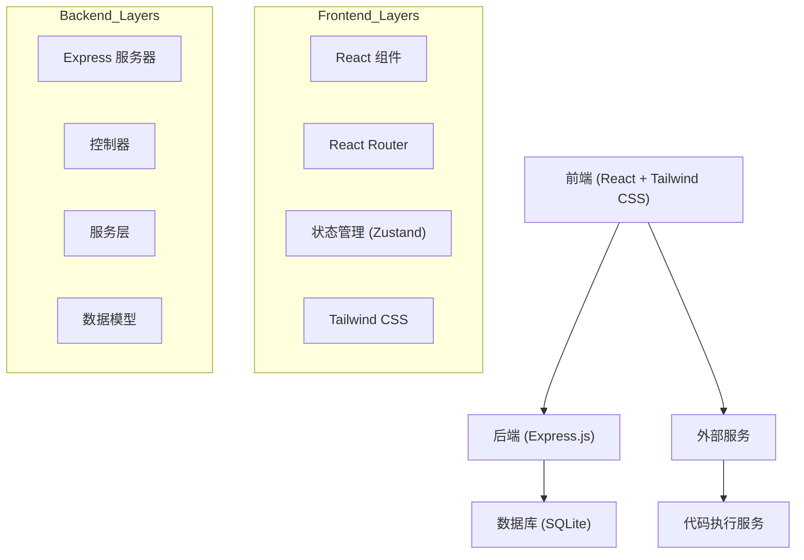
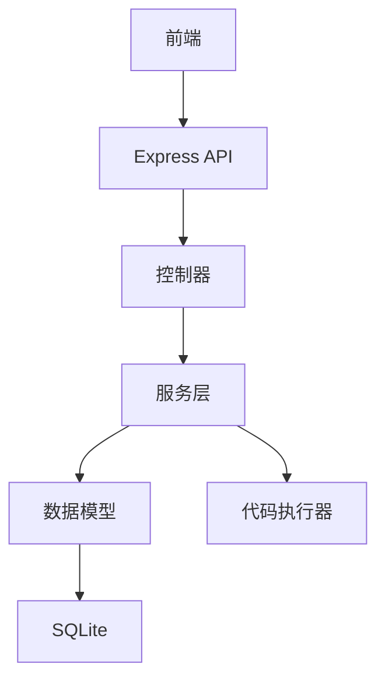
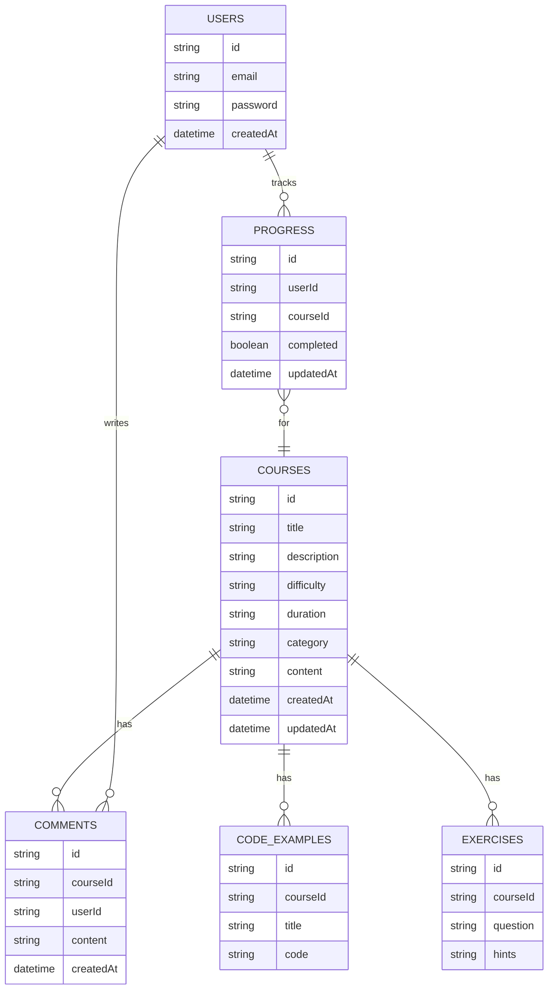

## 1. Architecture Design


## 2. Technology Description
- 前端: React@18 + Tailwind CSS@3 + Vite
- 初始化工具: vite-init
- 后端: Express@4 + Node.js
- 数据库: SQLite (轻量级，适合教育网站)
- 代码执行: 后端Python执行环境
- 状态管理: Zustand
- 路由: React Router

## 3. Route Definitions
| Route | Purpose |
|-------|---------|
| / | 首页 |
| /courses | 课程目录 |
| /courses/:id | 教程详情页 |
| /editor | 代码编辑器 |
| /learning-path | 学习路径 |
| /api/courses | 获取课程列表 |
| /api/courses/:id | 获取课程详情 |
| /api/execute | 执行Python代码 |

## 4. API Definitions
### 4.1 获取课程列表
- **请求**: GET /api/courses
- **响应**:
  ```typescript
  interface Course {
    id: string;
    title: string;
    description: string;
    difficulty: 'beginner' | 'intermediate' | 'advanced';
    duration: string;
    category: string;
    updatedAt: string;
  }
  
  type CoursesResponse = Course[];
  ```

### 4.2 获取课程详情
- **请求**: GET /api/courses/:id
- **响应**:
  ```typescript
  interface CourseDetail extends Course {
    content: string;
    codeExamples: {
      title: string;
      code: string;
    }[];
    exercises: {
      id: string;
      question: string;
      hints: string[];
    }[];
  }
  ```

### 4.3 执行Python代码
- **请求**: POST /api/execute
- **请求体**:
  ```typescript
  interface ExecuteRequest {
    code: string;
  }
  ```
- **响应**:
  ```typescript
  interface ExecuteResponse {
    output: string;
    error: string;
  }
  ```

## 5. Server Architecture Diagram


## 6. Data Model
### 6.1 Data Model Definition


### 6.2 Data Definition Language
```sql
-- 创建课程表
CREATE TABLE courses (
    id TEXT PRIMARY KEY,
    title TEXT NOT NULL,
    description TEXT NOT NULL,
    difficulty TEXT NOT NULL,
    duration TEXT NOT NULL,
    category TEXT NOT NULL,
    content TEXT NOT NULL,
    created_at DATETIME DEFAULT CURRENT_TIMESTAMP,
    updated_at DATETIME DEFAULT CURRENT_TIMESTAMP
);

-- 创建代码示例表
CREATE TABLE code_examples (
    id TEXT PRIMARY KEY,
    course_id TEXT NOT NULL,
    title TEXT NOT NULL,
    code TEXT NOT NULL,
    FOREIGN KEY (course_id) REFERENCES courses(id)
);

-- 创建练习表
CREATE TABLE exercises (
    id TEXT PRIMARY KEY,
    course_id TEXT NOT NULL,
    question TEXT NOT NULL,
    hints TEXT NOT NULL,
    FOREIGN KEY (course_id) REFERENCES courses(id)
);

-- 创建用户表
CREATE TABLE users (
    id TEXT PRIMARY KEY,
    email TEXT NOT NULL UNIQUE,
    password TEXT NOT NULL,
    created_at DATETIME DEFAULT CURRENT_TIMESTAMP
);

-- 创建评论表
CREATE TABLE comments (
    id TEXT PRIMARY KEY,
    course_id TEXT NOT NULL,
    user_id TEXT NOT NULL,
    content TEXT NOT NULL,
    created_at DATETIME DEFAULT CURRENT_TIMESTAMP,
    FOREIGN KEY (course_id) REFERENCES courses(id),
    FOREIGN KEY (user_id) REFERENCES users(id)
);

-- 创建进度表
CREATE TABLE progress (
    id TEXT PRIMARY KEY,
    user_id TEXT NOT NULL,
    course_id TEXT NOT NULL,
    completed BOOLEAN DEFAULT FALSE,
    updated_at DATETIME DEFAULT CURRENT_TIMESTAMP,
    FOREIGN KEY (user_id) REFERENCES users(id),
    FOREIGN KEY (course_id) REFERENCES courses(id),
    UNIQUE(user_id, course_id)
);

-- 插入初始课程数据
INSERT INTO courses (id, title, description, difficulty, duration, category, content) VALUES
('1', 'Python基础入门', 'Python编程语言的基础概念和语法', 'beginner', '2小时', '基础', '# Python基础入门\n\n## 1. Python简介\n\nPython是一种简单易学的编程语言，广泛应用于Web开发、数据科学、人工智能等领域。\n\n## 2. 安装Python\n\n访问 [Python官网](https://www.python.org/) 下载并安装最新版本的Python。\n\n## 3. 第一个Python程序\n\n```python\nprint("Hello, World!")\n```\n\n## 4. 变量和数据类型\n\nPython支持多种数据类型，包括整数、浮点数、字符串、布尔值等。\n\n```python\n# 整数\nx = 10\n\n# 浮点数\ny = 3.14\n\n# 字符串\nname = "Python"\n\n# 布尔值\nis_true = True\n```'),
('2', 'Python控制流', '学习Python的条件语句和循环结构', 'beginner', '1.5小时', '基础', '# Python控制流\n\n## 1. 条件语句\n\n使用if-elif-else语句进行条件判断。\n\n```python\nage = 18\nif age >= 18:\n    print("成年人")\nelif age >= 13:\n    print("青少年")\nelse:\n    print("儿童")\n```\n\n## 2. 循环结构\n\n### 2.1 for循环\n\n```python\nfor i in range(5):\n    print(i)\n```\n\n### 2.2 while循环\n\n```python\ni = 0\nwhile i < 5:\n    print(i)\n    i += 1\n```'),
('3', 'Python函数', '学习如何定义和使用函数', 'intermediate', '2小时', '进阶', '# Python函数\n\n## 1. 函数定义\n\n使用def关键字定义函数。\n\n```python\ndef greet(name):\n    """问候函数"""\n    return f"Hello, {name}!"\n\n# 调用函数\nprint(greet("Python"))\n```\n\n## 2. 函数参数\n\n### 2.1 位置参数\n\n```python\ndef add(a, b):\n    return a + b\n```\n\n### 2.2 关键字参数\n\n```python\ndef describe_person(name, age):\n    return f"{name} is {age} years old"\n\nprint(describe_person(age=30, name="Alice"))\n```\n\n### 2.3 默认参数\n\n```python\ndef greet(name, greeting="Hello"):\n    return f"{greeting}, {name}!"\n```'),
('4', 'Python数据结构', '学习列表、元组、字典等数据结构', 'intermediate', '2.5小时', '进阶', '# Python数据结构\n\n## 1. 列表 (List)\n\n列表是可变的有序集合。\n\n```python\n# 创建列表\nfruits = ["apple", "banana", "cherry"]\n\n# 访问元素\nprint(fruits[0])  # 输出: apple\n\n# 修改元素\nfruits[1] = "orange"\n\n# 添加元素\nfruits.append("grape")\n\n# 移除元素\nfruits.remove("cherry")\n```\n\n## 2. 元组 (Tuple)\n\n元组是不可变的有序集合。\n\n```python\n# 创建元组\ncolors = ("red", "green", "blue")\n\n# 访问元素\nprint(colors[1])  # 输出: green\n```\n\n## 3. 字典 (Dictionary)\n\n字典是键值对的集合。\n\n```python\n# 创建字典\nperson = {"name": "Alice", "age": 30, "city": "New York"}\n\n# 访问值\nprint(person["name"])  # 输出: Alice\n\n# 添加或修改键值对\nperson["job"] = "Engineer"\n\n# 移除键值对\ndel person["age"]\n```'),
('5', 'Python面向对象编程', '学习类、对象、继承等面向对象编程概念', 'advanced', '3小时', '高级', '# Python面向对象编程\n\n## 1. 类的定义\n\n使用class关键字定义类。\n\n```python\nclass Person:\n    def __init__(self, name, age):\n        self.name = name\n        self.age = age\n    \n    def greet(self):\n        return f"Hello, my name is {self.name}"\n```\n\n## 2. 创建对象\n\n```python\nalice = Person("Alice", 30)\nprint(alice.greet())  # 输出: Hello, my name is Alice\n```\n\n## 3. 继承\n\n```python\nclass Student(Person):\n    def __init__(self, name, age, student_id):\n        super().__init__(name, age)\n        self.student_id = student_id\n    \n    def study(self):\n        return f"{self.name} is studying"\n\n# 创建学生对象\nbob = Student("Bob", 20, "S12345")\nprint(bob.greet())  # 输出: Hello, my name is Bob\nprint(bob.study())  # 输出: Bob is studying\n```');

-- 插入代码示例数据
INSERT INTO code_examples (id, course_id, title, code) VALUES
('1', '1', 'Hello World', 'print("Hello, World!")'),
('2', '1', '变量赋值', 'x = 10\ny = 3.14\nname = "Python"\nis_true = True\nprint(x, y, name, is_true)'),
('3', '2', '条件语句', 'age = 18\nif age >= 18:\n    print("成年人")\nelif age >= 13:\n    print("青少年")\nelse:\n    print("儿童")'),
('4', '2', 'for循环', 'for i in range(5):\n    print(i)'),
('5', '2', 'while循环', 'i = 0\nwhile i < 5:\n    print(i)\n    i += 1'),
('6', '3', '函数定义', 'def greet(name):\n    """问候函数"""\n    return f"Hello, {name}!"\n\n# 调用函数\nprint(greet("Python"))'),
('7', '3', '默认参数', 'def greet(name, greeting="Hello"):\n    return f"{greeting}, {name}!"\n\nprint(greet("Alice"))\nprint(greet("Bob", "Hi"))'),
('8', '4', '列表操作', 'fruits = ["apple", "banana", "cherry"]\nprint(fruits[0])\nfruits[1] = "orange"\nfruits.append("grape")\nfruits.remove("cherry")\nprint(fruits)'),
('9', '4', '字典操作', 'person = {"name": "Alice", "age": 30, "city": "New York"}\nprint(person["name"])\nperson["job"] = "Engineer"\ndel person["age"]\nprint(person)'),
('10', '5', '类的定义和使用', 'class Person:\n    def __init__(self, name, age):\n        self.name = name\n        self.age = age\n    \n    def greet(self):\n        return f"Hello, my name is {self.name}"\n\nalice = Person("Alice", 30)\nprint(alice.greet())'),
('11', '5', '继承', 'class Student(Person):\n    def __init__(self, name, age, student_id):\n        super().__init__(name, age)\n        self.student_id = student_id\n    \n    def study(self):\n        return f"{self.name} is studying"\n\nbob = Student("Bob", 20, "S12345")\nprint(bob.greet())\nprint(bob.study())');

-- 插入练习数据
INSERT INTO exercises (id, course_id, question, hints) VALUES
('1', '1', '编写一个程序，输出你的名字和年龄', '["使用print函数", "使用字符串拼接"]'),
('2', '1', '计算1+2+3+...+100的和', '["使用循环", "使用sum函数"]'),
('3', '2', '判断一个数是否为偶数', '["使用取模运算符 %", "使用条件语句"]'),
('4', '2', '打印1到100之间的所有奇数', '["使用for循环", "使用条件判断"]'),
('5', '3', '编写一个函数，计算两个数的乘积', '["定义函数", "使用return语句"]'),
('6', '3', '编写一个函数，判断一个数是否为质数', '["质数定义", "使用循环和条件判断"]'),
('7', '4', '编写一个程序，统计列表中元素的出现次数', '["使用字典", "使用count方法"]'),
('8', '4', '编写一个程序，对列表进行排序', '["使用sort方法", "使用sorted函数"]'),
('9', '5', '编写一个类，表示一个矩形，包含计算面积和周长的方法', '["定义类", "实现方法"]'),
('10', '5', '编写一个类，表示一个银行账户，包含存款、取款和查询余额的方法', '["定义类", "实现方法", "处理边界情况"]');